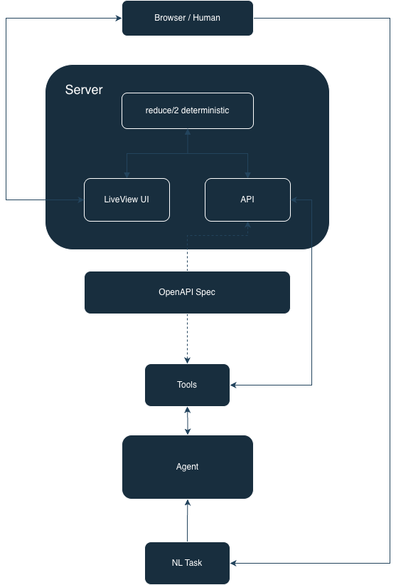

## Overview

A small demo of an AI agent interacting with a Phoenix LiveView application. The
system is designed so that a human can interact with the web app in the normal
way, and an agent can work on the same session through a controlled interface.
Work done by an agent is reflected in real-time on the web app.

## Quick Start

To test and start the server (starting from project root)
```
cd server
mix deps.get
mix test
mix phx.server
```

For the agent (again starting from project root)
```
# Get dependencies
uv sync --project agent

# Running anthropic, add key to a .env file (gitignoreed)
#   ANTHROPIC_API_KEY=...
uv run --env-file .env --project agent evals/run_evals.py
```
Files should be run as a script (no `-m`) so `agent/src/` is on `sys.path`.
The contract path resolves repo-relative regardless of cwd.

To test the server and agent tools (no model, no LLM cost), run the following
with the server running:
```
# generate (session_id, watchUrl) for new session
curl -s -XPOST localhost:4000/api/sessions | jq

# Copy session_id to to environment variable 
ID=sess_...

# Navigate to watchUrl, then run curl command to see supplier S-002 get highlighted
curl -s -XPOST localhost:4000/api/sessions/sess_323fe2fc99ee/actions \
  -H 'content-type: application/json' \
  -d '{"kind":"select_supplier", "id": "S-002"}' -w '\n%{http_code}\n'

# Agent's HTTP/tools, model-free
uv run --project agent agent/src/tools.py
```

## Design



The API and agent tools are both derived from an OpenAPI spec to ensure they are
always in sync. Each session maintains a state. Changes to the state are
deterministic, produced by feeding the current state and an action to
`reduce/2`. A LiveView front end reflects the current state in real time, and
a human can make changes to it through the UI. The agent reads and modifies the
same state through calls to the API, and a full trace of agent actions are
traced for observability. By design, the full trace of the agent's work is
append only, and all information not pertinent to the task, including the Id of
the session it is working in, is withheld from the agent.
